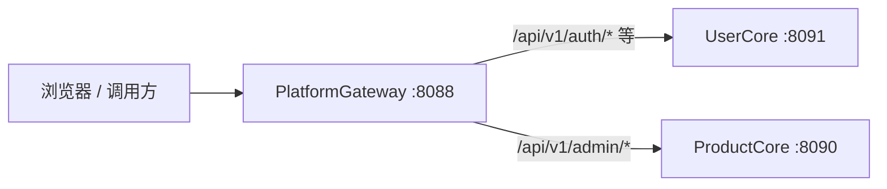

# PlatformGateway

**统一 API 入口（反向代理 + 轻量鉴权）**，把 UserCore（IAM）和 ProductCore（PIM）聚合成一个对外地址。

## 它是做什么的？

开发/部署时，浏览器或外部系统**不必分别记** `8091`（UserCore）和 `8090`（ProductCore），只访问 Gateway 即可：



| 能力 | 说明 |
|------|------|
| **路由聚合** | 按 URL 前缀把请求转发到对应后端 |
| **JWT 预校验** | 访问 PIM（`/api/v1/admin/*`）前校验 Bearer Token，非法直接 401 |
| **租户头注入** | 校验通过后写入 `X-Tenant-ID`、`X-User-ID`（供后续扩展） |
| **CORS 统一** | 一处配置允许的前端 Origin |

Gateway **不负责**：用户注册、发 JWT、商品业务逻辑——这些仍在 UserCore / ProductCore。

## 路由

| 路径 | 上游 | 说明 |
|------|------|------|
| `POST /api/v1/auth/login` | UserCore | 公开，登录 |
| `/api/v1/admin/*` | ProductCore | 需 JWT（`jwt.validate_pim: true`） |
| `/api/v1/*` | UserCore | 其余 IAM（`/auth/me`、用户、租户等） |

默认端口：**8088**

## 启动

```bash
cp configs/config.example.yaml configs/config.yaml
# jwt.secret 与 UserCore、ProductCore 一致

make run
```

健康检查：`GET http://localhost:8088/health`

## 前端接入（可选）

在 `.env` 中启用 Gateway 模式，Vite 会把 `/api` 代理到 `8088`：

**UserCore** `web/.env`：
```
VITE_API_GATEWAY=http://localhost:8088
```

**ProductCore** `web/.env`：
```
VITE_API_GATEWAY=http://localhost:8088
```

未设置时仍直连各服务（8091 / 8090），本地调试更简单。

## 何时必须用 Gateway？

| 场景 | 建议 |
|------|------|
| 本地只跑 UserCore + ProductCore | **可选**，直连即可 |
| 生产单域名 `api.example.com` | **推荐**，统一入口 + HTTPS |
| 后续接 OMS/WMS 等更多服务 | **推荐**，Gateway 加路由即可 |
| 对外 Open API | **推荐**，统一鉴权与限流 |
